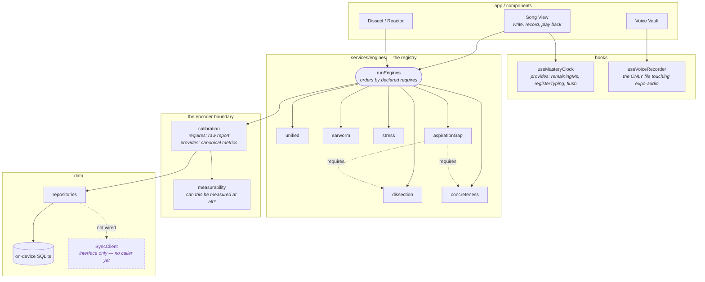

# Component view

What the parts are and what each one promises. Ball = provided interface,
socket = required interface.



## The two enforced boundaries

**1. The encoder boundary.** Engines provide a raw report. Calibration requires
it and provides canonical metrics. Repositories require canonical metrics and
will not accept anything else.

`persistCalibratedSession.test.ts` fails if a raw score reaches a SQL
parameter. That is an interface *enforced*, not merely documented — the rare
kind.

**2. The engine registry.** Each engine declares `id`, `requires`, and its
output type. `runEngines` derives execution order from those declarations.

Reading an engine you did not declare throws. Removing an engine whose weight
fed the composite index fails the weight assertion before anything runs.

Before the registry, `aspirationGap`'s dependency on `dissection` and
`concreteness` existed only in the order two `const` lines happened to appear
in. Removing `concreteness` broke a block that never mentioned it by name.

## Development view — layer rules

```
app → components → hooks → services → data → utils
```

**Verified**: nothing imports upward and there are no cycles. `data` imports
only `utils` and `config`.

That property is expensive to retrofit and cheap to keep. Adding an import
that points up the stack is the one change that should always be questioned.

## Known gaps

- **`SyncClient` has no caller.** The interface and the Railway implementation
  both exist; nothing calls `push` or `pull`.
- **Composite weights are arbitrary.** `0.30 / 0.25 / 0.15 / 0.15 / 0.15` are
  inherited from a hardcoded formula, not derived from any measured
  population. They are gathered in one `WEIGHTS` constant so the arbitrariness
  is visible rather than scattered.
- **Ten canonical metrics have no measurability rule.** Deliberate — they are
  declared ahead of the engines that will produce them, and
  `namespaceSync.test.ts` holds the list so it cannot grow silently.
