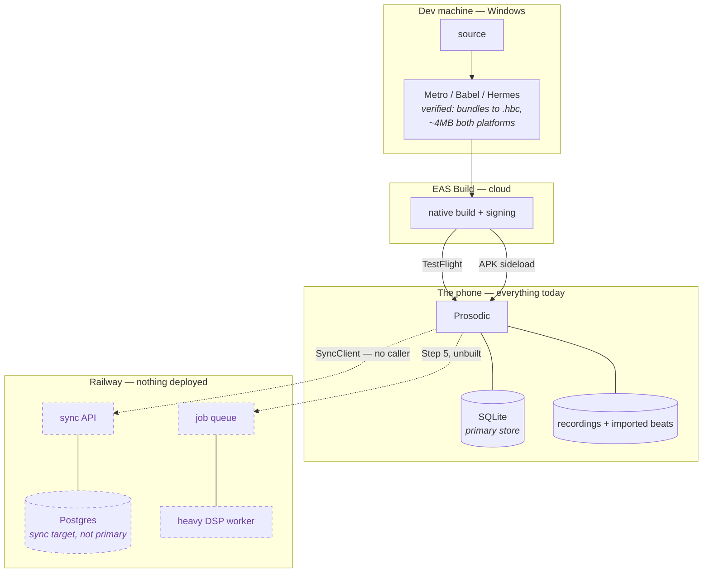

# Physical view — where it runs

The view that was never drawn, and the reason Step 5 sat at 20% while
everything else moved. Its exit criterion — *"record ten seconds on a real
device"* — is a deployment statement, not a feature.



## What is actually true today

**Everything runs on the phone.** SQLite is the primary store, not a cache.
The app is fully functional offline and has no network dependency at all.

**Nothing is deployed.** Railway is chosen. `SyncClient` and
`railwaySyncClient` both exist. Neither is called.

**The bundle is verified, the device is not.** `expo export` produces Hermes
bytecode for both platforms. That proves the JavaScript compiles and resolves.
It does not link a single native module — `expo-audio` and `expo-sqlite` are
bound during the native build, which EAS does and this machine cannot.

## Getting to a device

```
Android    eas build -p android --profile preview  →  APK  →  sideload
           no store account needed. free.

iOS        Apple Developer Program  →  eas build -p ios  →  TestFlight
```

`eas.json` needs `"android": { "buildType": "apk" }` on the preview profile.
Without it an AAB may come back, which is a Play Store format and cannot be
installed directly.

## The split that decides where analysis runs

| Work | Where | Why |
|---|---|---|
| Voice-activity detection | on device | the Mastery clock needs "is a voice happening right now," and it must work offline |
| Rhyme / cadence / density / motif / stress | on device | pure text, cheap, already runs |
| Formant / pitch / microtiming / beat grid | server | real DSP, impractical under Expo without ejecting |
| Dream Window overnight cycle | server | the first feature needing the backend to *act* rather than store and relay |

## What the server costs when it arrives

Marginal cost per user, unlike most software:

- DSP compute per uploaded take
- audio storage, growing forever
- LLM calls once Osborne exists

Not zero, and it scales with users. Worth knowing before pricing.

## Split-brain, by construction

Local-first plus an eventual sync target means **every offline session is a
network partition** and every reconnect is a partition healing.

**Already safe:** `events`, `voice_takes`, and `line_edits` are append-only,
with tests asserting no `ON CONFLICT`. Append-only rows cannot conflict.
`mastery_state` uses `MAX(committed_ms, excluded.committed_ms)` — a grow-only
register that merges correctly regardless of arrival order.

**Not safe:** `song_context.body_text` is a blind overwrite with no version.
Two devices editing offline lose one side's writing, with no conflict and no
error. Only bites once sync has a caller, which is why it is logged rather than
fixed.

**Also waiting:** `generateId()` is a timestamp plus eight random base-36
characters. Fine within one device, not a guarantee across devices sharing a
primary key. Its own comment flags this.
